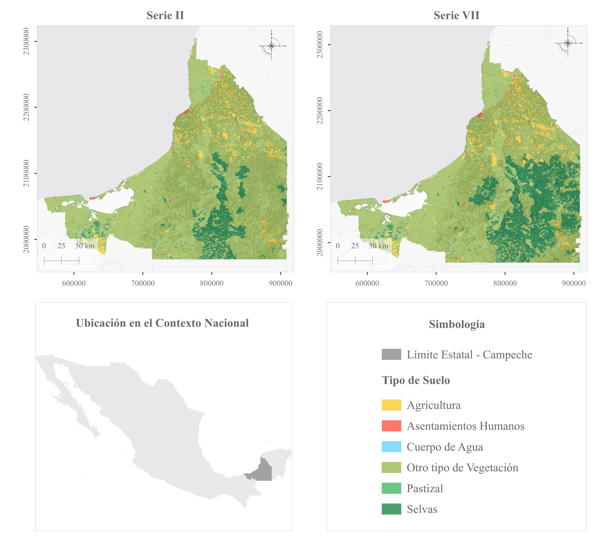
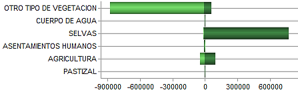

# Análisis de cambio de uso de suelo mediante LUCC en Campeche (2001–2021)

## Descripción

Este proyecto analiza la dinámica de cambio de uso de suelo y cobertura vegetal en el estado de Campeche, México, entre los años 2001 y 2021.

El análisis se desarrolló mediante herramientas de Sistemas de Información Geográfica (SIG), procesamiento vectorial y raster, tabulación cruzada y análisis de pérdidas, ganancias y transiciones entre categorías de cobertura.

Se prestó especial atención a la dinámica de la cobertura de **selvas**, debido a su importancia ecológica en la región.

---

## Objetivo

Analizar los cambios espaciales y territoriales en el uso de suelo y la cobertura vegetal del estado de Campeche entre 2001 y 2021, identificando:

* Cambios netos por categoría.
* Pérdidas y ganancias de cobertura.
* Persistencia territorial.
* Principales transiciones entre categorías.
* Dinámica espacial de la cobertura de selvas.

---

## Área de estudio

El área de estudio corresponde al estado de **Campeche, México**, una región caracterizada por una importante presencia de ecosistemas tropicales, actividades agropecuarias y procesos de transformación territorial.

---

## Datos

Se utilizaron datos de uso de suelo y vegetación correspondientes a:

| Año  | Serie     |
| ---- | --------- |
| 2001 | Serie II  |
| 2021 | Serie VII |

Las categorías originales fueron homogeneizadas en seis clases generales:

* Agricultura
* Asentamientos humanos
* Cuerpos de agua
* Otro tipo de vegetación
* Pastizal
* Selvas

Esta homologación fue necesaria para permitir la comparación entre ambos periodos.

---

## Flujo de trabajo

```text
Datos de uso de suelo y vegetación
              ↓
   Homogeneización de categorías
              ↓
      Reproyección espacial
              ↓
           Dissolve
              ↓
        Reclasificación
              ↓
         Rasterización
              ↓
     Homologación de resolución
              ↓
       Análisis LUCC raster
              ↓
      Pérdidas y ganancias
              ↓
      Tabulación cruzada
              ↓
      Matriz de transición
              ↓
       Análisis de resultados
```

---

## Metodología

### 1. Preprocesamiento vectorial

Las capas fueron reproyectadas a un sistema de referencia espacial común. Posteriormente, se aplicaron procesos de disolución y reclasificación temática para homologar las categorías de uso de suelo.

### 2. Conversión a formato raster

Las capas vectoriales fueron convertidas a formato raster utilizando una resolución espacial común para garantizar la compatibilidad entre los años 2001 y 2021.

### 3. Análisis de cambio

Se calcularon:

* Superficie por categoría.
* Porcentaje de cobertura.
* Cambio neto.
* Pérdidas y ganancias.
* Persistencia.
* Intercambio entre categorías.
* Transiciones específicas.

### 4. Tabulación cruzada

Se construyó una matriz de transición para identificar las conversiones entre categorías de cobertura y analizar los patrones de persistencia y transformación territorial.

---

## Resultados principales

### Cambio neto 2001–2021

| Categoría               |    Cambio neto |
| ----------------------- | -------------: |
| Selvas                  | +761,904.69 ha |
| Agricultura             |  +46,228.13 ha |
| Asentamientos humanos   |   +3,346.88 ha |
| Pastizal                |     −496.88 ha |
| Cuerpos de agua         |     −893.75 ha |
| Otro tipo de vegetación | −810,089.06 ha |

La categoría de **selvas** presentó el mayor incremento neto, mientras que **otro tipo de vegetación** presentó la mayor reducción.

### Persistencia y cambio

* **Persistencia territorial:** 83.13%
* **Área con cambio:** 16.87%

La mayor parte del territorio mantuvo su categoría entre ambos periodos, aunque se identificaron transformaciones importantes en determinadas coberturas.

### Dinámica de las selvas

La principal contribución al incremento de la cobertura de selvas provino de la transición desde la categoría **“otro tipo de vegetación”**.

La cobertura de selvas presentó:

* Pérdidas: aproximadamente **14,650 ha**
* Ganancias: aproximadamente **776,555 ha**

Este resultado debe interpretarse considerando tanto posibles procesos de regeneración como diferencias metodológicas entre las series de datos utilizadas.

---

## Visualizaciones

### Coberturas de uso de suelo




### Pérdidas y ganancias de selvas




## Herramientas utilizadas

* **QGIS** — procesamiento vectorial, rasterización y cartografía.
* **TerrSet** — análisis de cambio de uso de suelo, tabulación cruzada y modelación espacial.
* **Datos geoespaciales** — capas de uso de suelo y vegetación.
* **Análisis raster** — comparación temporal y clasificación temática.

---

## Principales habilidades demostradas

* Análisis espacial
* Procesamiento de datos geoespaciales
* Análisis raster
* Homogeneización de categorías temáticas
* Modelación LUCC
* Análisis de pérdidas y ganancias
* Matrices de transición
* Tabulación cruzada
* Cartografía temática
* Interpretación de cambios territoriales

---

## Limitaciones

El análisis utiliza dos cortes temporales y depende de datos secundarios con diferencias metodológicas entre las series utilizadas.

Por esta razón, los cambios identificados deben interpretarse considerando posibles diferencias en los criterios de clasificación y generalización temática de las fuentes de información.

---

## Conclusión

El análisis permitió identificar una transformación relevante en la estructura de coberturas del estado de Campeche entre 2001 y 2021.

Los resultados muestran una predominancia de la persistencia territorial, acompañada por cambios importantes en la composición del paisaje. La cobertura de selvas presentó una expansión neta considerable, principalmente asociada a la transición desde la categoría “otro tipo de vegetación”, mientras que la agricultura mostró una dinámica de intercambio territorial.

Este proyecto demuestra la aplicación de herramientas SIG y métodos de análisis espacial para estudiar dinámicas territoriales y cambios de cobertura a través del tiempo.

